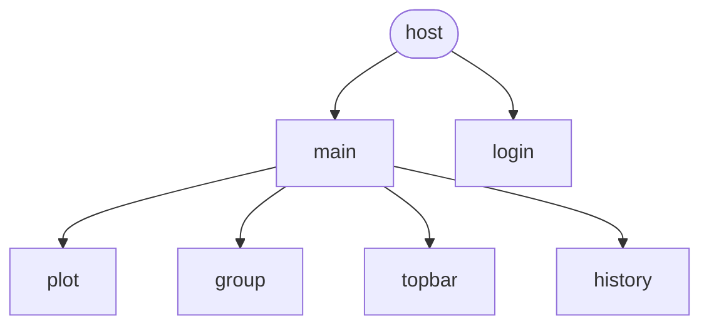

# WebProgramming_lab4


## Overview
Стек: React + Webpack Module Federation, Jakarta EE (JAX-RS), gRPC, Docker, JWT, CSRF, SAGA.

Проект представляет собой веб-приложение с микросервисной архитектурой и микрофронтендами,
реализующее аутентификацию пользователей, работу с группами данных и визуализацию результатов.
Frontend построен на React с Webpack Module Federation, backend — на Jakarta EE.

## Quickstart
```bash
docker compose up --build
```

## Что изучено?
1. Принципы построения микросервисной архитектуры
2. Настройка _Webpack_ и создание микрофронтендов с помощью _Webpack Module Federation_
3. Написание приложений на _React19_
4. Использование _redux_ и _redux-toolkit_ для хранения данных
5. Организация monorepo для фронтенда
6. Как использовать _SecurityContext_ и как делать авторизацию cookie/header в jakarta-ee
7. Как работать с _docker multistage_ и _docker buildkit_
8. Реализация взаимодействия микросервисов по _gRPC_
9. Паттерн _SAGA (orchestration)_ для согласованного выполнения распределённых транзакций
10. Защита от CSRF-атак и работа с _JWT_

#### Frontend
С помощью `Webpack module federation`, реализован набор микрофронтендов со следующей структурой

#### Backend
Реализован набор JAX-RS микросервисов, каждый из которых отвечает за свою зону ответственности:
- authService
    - регистрация и аутентификация пользователей
    - выдача JWT (cookie)
- geometryService
    - проверка попадания точки в заданную область
- historyService
    - сохранение и получение истории результатов
    - группировка данных

Микросервисы взаимодействуют друг с другом по gRPC, а регистрация пользователя реализована как распределённая транзакция
с использованием паттерна SAGA (orchestration): при ошибке на одном из этапов выполняются компенсирующие действия.

Также написаны дополнительные пакеты:
- csrfSecurity
    - защита от CSRF-атак
    - аннотации @CsrfSecured, @CsrfProvider
- jwtProcessing
    - обработка JWT
    - аннотация @JwtSecured для защиты эндпоинтов

## Структура проекта

```
├── backend/                    # всё, что связано с бэкендом
    ├── authService/            # микросервис, реализующий аутентификацию пользователей
    ├── geometryService/        # микросервис, реализующий проверку попадания точки в область
    ├── historyService/         # микросервис, ответственный за хранение и запись групп результатов
    ├── csrfSecurity/           # пакет, помогающий рализовать защиту от CSRF атак (@CsrfSecured и @CsrfProvider)
    └── jwtProcessing/          # пакет, помогающий рализовать авторизацию по JWT в Cookie (@JwtSecured)
├── database/init.sql           # скрипт, исполняемый при первом запуске СУБД
└── frontend/                   # всё, что связано с фронтендом
    ├── nginx-conf/nginx.conf   # конфигурация для nginx
    └── monorepo/               # монорепозиторий со всеми исходниками
         ├── packages/          # вспомогательные пакеты
            ├── shared/         # общие пакеты - переиспользуемые UI компоненты и общий redux
            └── build-config/   # конфигурационные файлы для Webpack (loader-ы, плагины, resolve-ы and etc)
        └── services/           # директория с микрофронтендами
            ├── host/           # host микрофронтенд, являющийся точкой входа в приложение
            ├── login/          # микрофронтенд с страницей входа
            ├── main/           # микрофронтенд с основной страницей
            ├── plot/           # микрофронтенд с графиком
            ├── topbar/         # микрофронтенд с топбаром для страниц (пока содержит только settings -> logout)
            ├── history/        # микрофронтенд с историей попаданий
            └── groups/         # микрофронтенд с селектором групп
```
